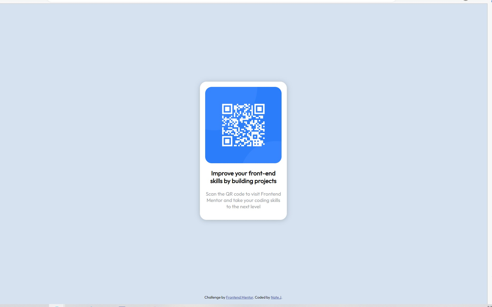

# Frontend Mentor - QR code component solution

This is a solution to the [QR code component challenge on Frontend Mentor](https://www.frontendmentor.io/challenges/qr-code-component-iux_sIO_H). Frontend Mentor challenges help you improve your coding skills by building realistic projects.

## Table of contents

- [Overview](#overview)
  - [Screenshot](#screenshot)
- [My process](#my-process)
  - [Built with](#built-with)
  - [What I learned](#what-i-learned)
  - [Useful resources](#useful-resources)

## Overview

### Screenshot

## My process

### Built with

- Semantic HTML5 markup
- CSS custom properties
- Flexbox
- CSS Grid

### What I learned

I am just a backend developer doing projects to get more comfortable with frontend UI design without always relying on Bootstrap etc. I am still getting more comfortable with CSS grid and flexbox.

### Useful resources

- Ask ChatGPT to give you simple examples of the things you want to create. Ask it to use Bootstrap if you want to learn about framework usage. GPT-4 does a phenomenal job at helping you get a baseline to dissect that isn't overwhelming.
